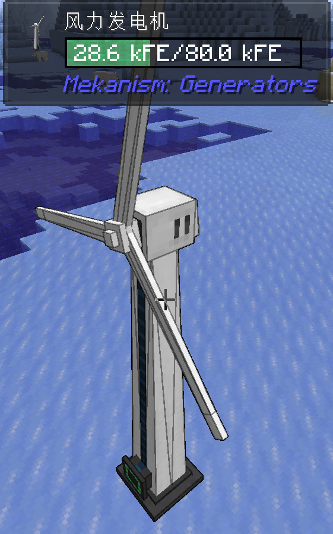

# BoundingBlock的实现——mek源码分析

## BoundingBlock是什么

<p><em>图1：Mekanism中的风力发电机，大小为1x5x1</em></p>
Mekanism中有一些机器，占用多个格子，但是行为却像一个单一的方块：具有单一的模型、直接由对应的物品放置（而不像多方块结构由多个不同方块组成）。
这种机器我暂且中文称之为“大型方块”（Mekanism代码中称之为BoundingBlock）。


## BoundingBlock怎么实现

### 方块（Block）部分

首先来到风力发电机（WindGenerator）的注册代码：
[mekanism.generators.common.registries.GeneratorsBlockTypes](https://github.com/mekanism/Mekanism/blob/9c21d943e65277231cffb2f739a246b047cbda20/src/generators/java/mekanism/generators/common/registries/GeneratorsBlockTypes.java#L94-L117)
```java startLineNumber=94
// Wind Generator
public static final Generator<TileEntityWindGenerator> WIND_GENERATOR = GeneratorBuilder
      .createGenerator(() -> GeneratorsTileEntityTypes.WIND_GENERATOR, GeneratorsLang.DESCRIPTION_WIND_GENERATOR)
      .withGui(() -> GeneratorsContainerTypes.WIND_GENERATOR)
      .withEnergyConfig(MekanismGeneratorsConfig.storageConfig.windGenerator)
      .withCustomShape(BlockShapes.WIND_GENERATOR)
      .with(AttributeCustomSelectionBox.JAVA)
      .withSound(GeneratorsSounds.WIND_GENERATOR)
      .with(AttributeUpgradeSupport.MUFFLING_ONLY)
      .withBounding(new HandleBoundingBlock() {
          @Override
          public <DATA> boolean handle(Level level, BlockPos pos, BlockState state, DATA data, TriBooleanFunction<Level, BlockPos, DATA> consumer) {
              BlockPos.MutableBlockPos mutable = new BlockPos.MutableBlockPos();
              for (int i = 0; i < 4; i++) {
                  mutable.setWithOffset(pos, 0, i + 1, 0);
                  if (!consumer.accept(level, mutable, data)) {
                      return false;
                  }
              }
              return true;
          }
      })
      .withComputerSupport("windGenerator")
      .build();
```
很显然的，与大型方块相关的代码就是103-117行的`withBounding`方法，参数是一个`HandleBoundingBlock`对象。
这个对象重写了`handle`方法。这个方法的用处是什么？转到`BlockType::BlockTypeBuilder.withBounding`方法的定义：
[mekanism.common.content.blocktype.BlockType](https://github.com/mekanism/Mekanism/blob/9f6de679aeec9bc3775e1d41bf142af228572119/src/main/java/mekanism/common/content/blocktype/BlockType.java#L118-L120)
```java startLineNumber=118
public final T withBounding(HandleBoundingBlock boundingPosHandlers) {
    return with(new AttributeHasBounding(boundingPosHandlers));
}
```
转到`with`方法的定义：
[mekanism.common.content.blocktype.BlockType](https://github.com/mekanism/Mekanism/blob/9f6de679aeec9bc3775e1d41bf142af228572119/src/main/java/mekanism/common/content/blocktype/BlockType.java#L113-L116)
```java startLineNumber=113
public final T with(Attribute... attrs) {
    holder.add(attrs);
    return self();
}
```
emmm，看来这里是将`AttributeHasBounding`对象加入到`holder`中。那么实际调用`handle`方法的地方在哪里呢？
搜索`AttributeHasBounding`的引用，在`BlockMekanism`中发现两处用法：
[mekanism.common.block.BlockMekanism](https://github.com/mekanism/Mekanism/blob/cd1cd949c335a8ccd67217a319f74e6f914fc521/src/main/java/mekanism/common/block/BlockMekanism.java#L147-L168)
```java startLineNumber=147
@Override
public void setPlacedBy(@NotNull Level world, @NotNull BlockPos pos, @NotNull BlockState state, @Nullable LivingEntity placer, @NotNull ItemStack stack) {
    super.setPlacedBy(world, pos, state, placer, stack);
    AttributeHasBounding hasBounding = Attribute.get(state, AttributeHasBounding.class);
    if (hasBounding != null) {
        hasBounding.placeBoundingBlocks(world, pos, state);
    }
    // 无关代码
}
```
这个`setPlacedBy`是在方块被放置时调用的。方法首先执行了原版的方块放置逻辑，然后判断放置的方块有没有`AttributeHasBounding`特性，
如果有，就执行特性的`placeBoundingBlocks`方法。
[mekanism.common.block.attribute.AttributeHasBounding](https://github.com/mekanism/Mekanism/blob/7e605b85b8bca4697629f04f9e6c463f645b08ba/src/main/java/mekanism/common/block/attribute/AttributeHasBounding.java#L49-L64)
```java startLineNumber=49
public void placeBoundingBlocks(Level world, BlockPos orig, BlockState state) {
    boundingPosHandlers.handle(world, orig, state, orig, (level, boundingLocation, data) -> {
        BlockBounding boundingBlock = MekanismBlocks.BOUNDING_BLOCK.getBlock();
        BlockState newState = BlockStateHelper.getStateForPlacement(boundingBlock, boundingBlock.defaultBlockState(), level, boundingLocation, null, Direction.NORTH);
        level.setBlock(boundingLocation, newState, Block.UPDATE_ALL);
        if (!level.isClientSide()) {
            TileEntityBoundingBlock tile = WorldUtils.getTileEntity(TileEntityBoundingBlock.class, level, boundingLocation);
            if (tile != null) {
                tile.setMainLocation(data);
            } else {
                Mekanism.logger.warn("Unable to find Bounding Block Tile at: {}", boundingLocation);
            }
        }
        return true;//todo decide if this should bail on failure with partially place blocks
    });
}
```
在这里，注册时重写的`handle`方法终于登场了！在此处，给`handle`传入的`data`是放置的方块坐标。结合这里传入的`consumer`，前面`WindGenerator`注册时的`handle`方法翻译成人话就是：
在放置的方块位置上的1~4格位置，依次放置用于占位的`BlockBounding`，然后获取其`TileEntity`并设置主方块。

再看另一处用法：
[mekanism.common.block.BlockMekanism](https://github.com/mekanism/Mekanism/blob/cd1cd949c335a8ccd67217a319f74e6f914fc521/src/main/java/mekanism/common/block/BlockMekanism.java#L130-L145)
```java startLineNumber=130
@Override
protected void onRemove(@NotNull BlockState state, @NotNull Level world, @NotNull BlockPos pos, @NotNull BlockState newState, boolean isMoving) {
    if (!state.is(newState.getBlock())) {
        AttributeHasBounding hasBounding = Attribute.get(state, AttributeHasBounding.class);
        if (hasBounding != null) {
            hasBounding.removeBoundingBlocks(world, pos, state);
        }
    }
    // 无关代码
    super.onRemove(state, world, pos, newState, isMoving);
}
```
这个`onRemove`方法是在移除方块时调用的，调用了`AttributeHasBounding`的`removeBoundingBlocks`方法。
[mekanism.common.block.attribute.AttributeHasBounding](https://github.com/mekanism/Mekanism/blob/7e605b85b8bca4697629f04f9e6c463f645b08ba/src/main/java/mekanism/common/block/attribute/AttributeHasBounding.java#L33-L47)
```java startLineNumber=33
public void removeBoundingBlocks(Level world, BlockPos pos, BlockState state) {
    boundingPosHandlers.handle(world, pos, state, null, (level, p, ignored) -> {
        BlockState boundingState = level.getBlockState(p);
        if (!boundingState.isAir()) {
            //The state might be air if we broke a bounding block first
            if (boundingState.is(MekanismBlocks.BOUNDING_BLOCK.getBlock())) {
                level.removeBlock(p, false);
            } else {
                Mekanism.logger.warn("Skipping removing block, expected bounding block but the block at {} in {} was {}", p, level.dimension().location(),
                      RegistryUtils.getName(boundingState.getBlock()));
            }
        }
        return true;
    });
}
```
这个方法给`handle`传的`data`是`null`（话说这种情况下推断的DATA泛型会是什么呢？）。方法的作用是，把之前创建的`BlockBounding`全部移除掉。

### 物品（Item）部分
BoundingBlock的物品放置逻辑在`ItemBlockTooltip`类中。（话说这什么鬼名字。）
