# 为Jetbrains系IDE接入DeepSeek

## 使用体验
对话体验比 Github Copilot 好，但是代码补全速度慢于 Github Copilot 。   
两天只用了五毛钱

## 创建 DeepSeek API key

在[DeepSeek开放平台](https://platform.deepseek.com/api_keys)创建 API key。
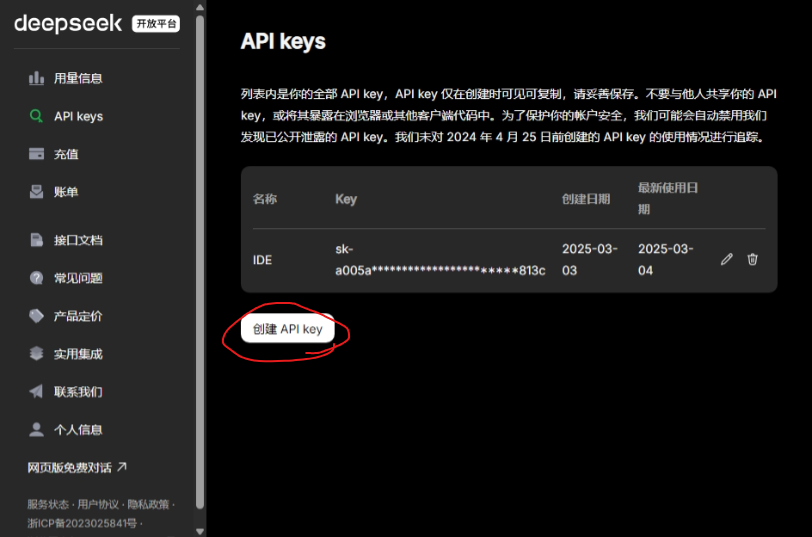
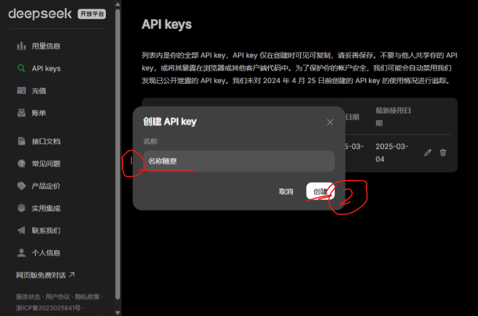
创建完成后，需要复制API key并妥善保存。
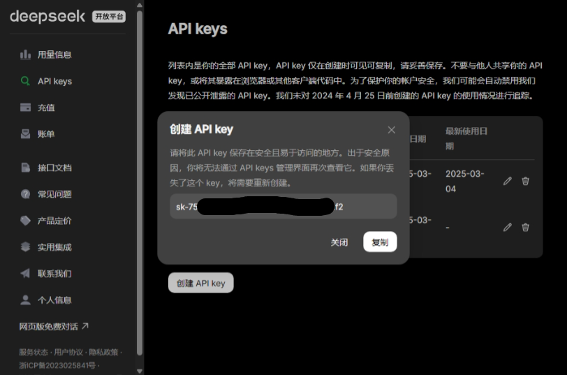
> **⚠** 关闭这个弹窗后，你就无法再次看到这个 API key。
> 如果你丢失了 API key，你只能删除现有的 API key 并创建一个新的。   
> 如果你的 API key 泄露了，那么任何人都可以使用它来访问你的 DeepSeek API。
> 如果你不想账单被刷爆，你也应该立即删除现有的 API key 并创建一个新的。

## 给 DeepSeek 充值
> 充值前需要实名认证

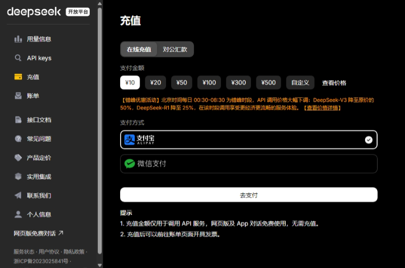

~~不充钱还想用？~~ 我不确定 DeepSeek 有没有免费使用额度，也许你可以尝试一下。

## 为你的 IDE 安装 Proxy AI 插件

> 此处以 IDEA 为例，其他 JetBrains IDE 同理 

> **ℹ** Proxy AI 曾用名 CodeGPT，因此在 Proxy AI 的 UI 和设置中有许多"CodeGPT"字眼

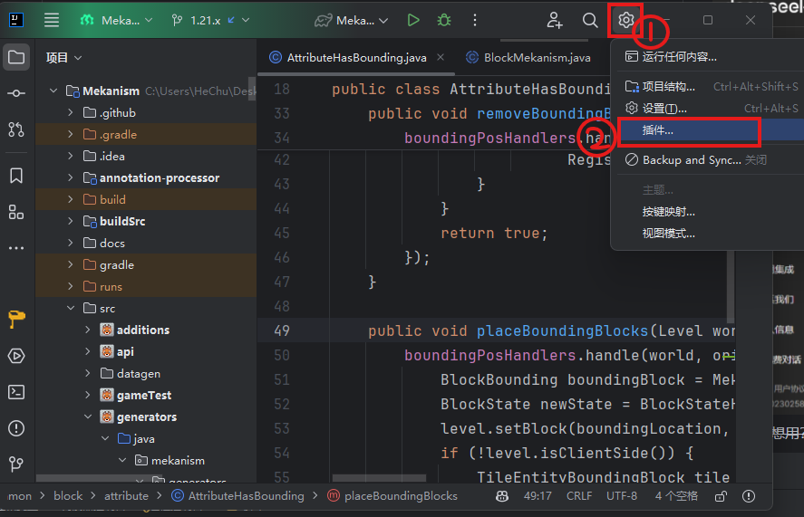
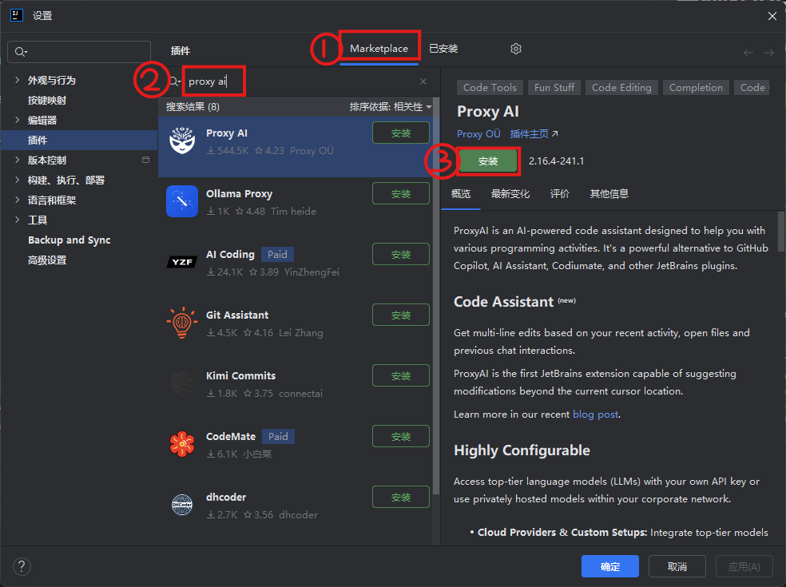

安装完成后，你应该能在 IDE 的右侧边栏看到 CodeGPT 的图标。这就是使用聊天功能的地方

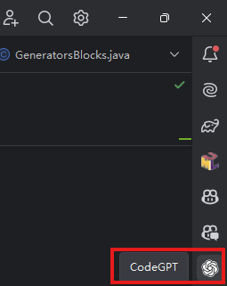

如果没有，在左侧边栏的省略号中打开

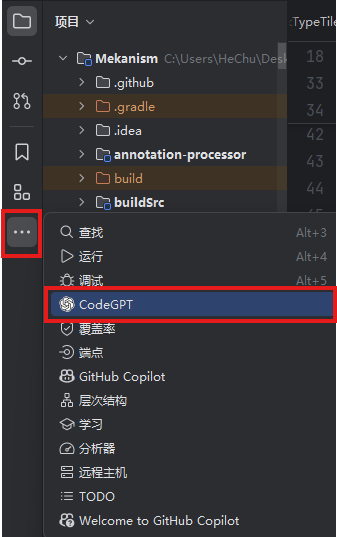

## 为 Proxy AI 配置 DeepSeek

在设置中搜索`codegpt`，然后点击"工具 > CodeGPT > Providers > Custom OpenAI"

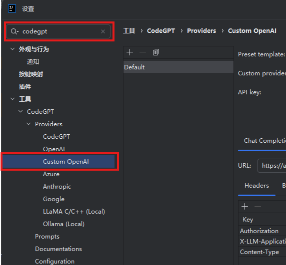

> 参考[对话补全 | DeepSeek API Docs](https://api-docs.deepseek.com/zh-cn/api/create-chat-completion)

将"Custom provider name"改为`DeepSeek`（或者你喜欢的名字）；
在"API Key"中填入你申请的 API key
将"Chat Completions"中的"URL"改为`https://api.deepseek.com/chat/completions`

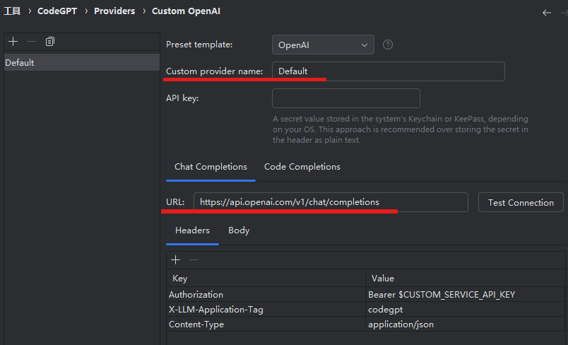

然后就能使用聊天功能了！

> 记得在 chat 界面左下角选择使用的模型

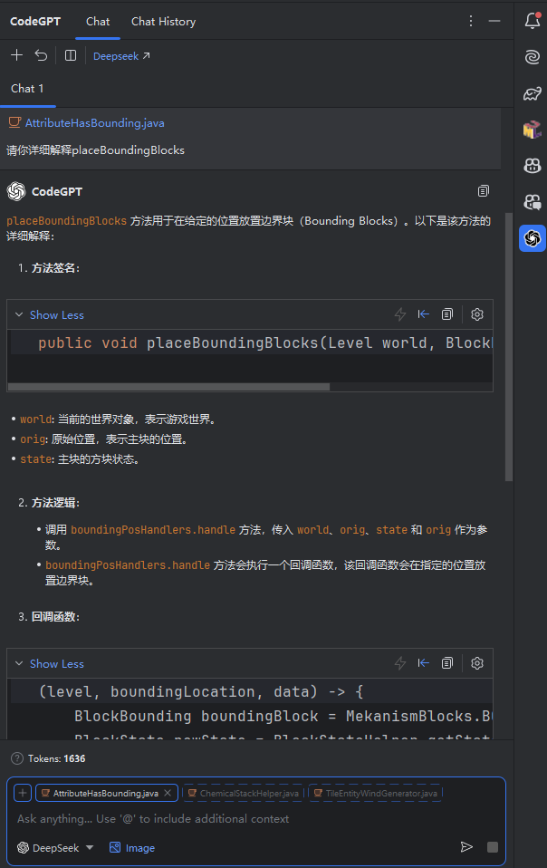

将"Chat Completions"中的"Body"中的"model"改为`deepseek-chat`；
酌情调整"max_tokens"（DeepSeek文档中的默认值为`4096`

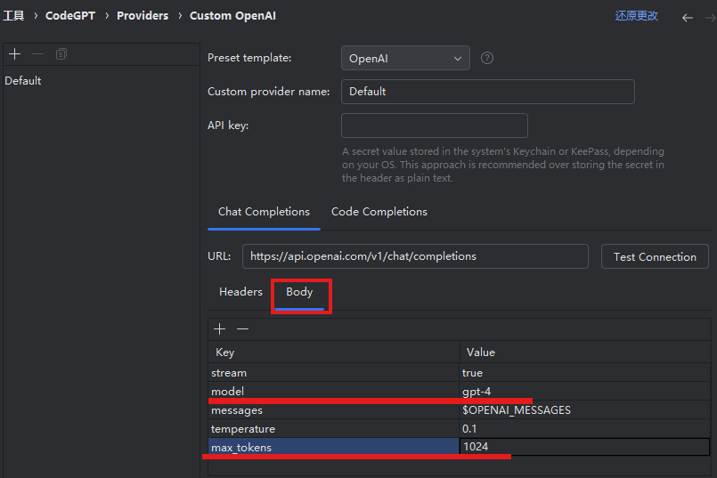

> 参考[FIM 补全（Beta） | DeepSeek API Docs](https://api-docs.deepseek.com/zh-cn/api/create-completion)

转到"Code Completions"，将"URL"改为`https://api.deepseek.com/beta/completions` ；  
将"Body"中的"Model"改为`deepseek-chat`；  
酌情调整"max_tokens"

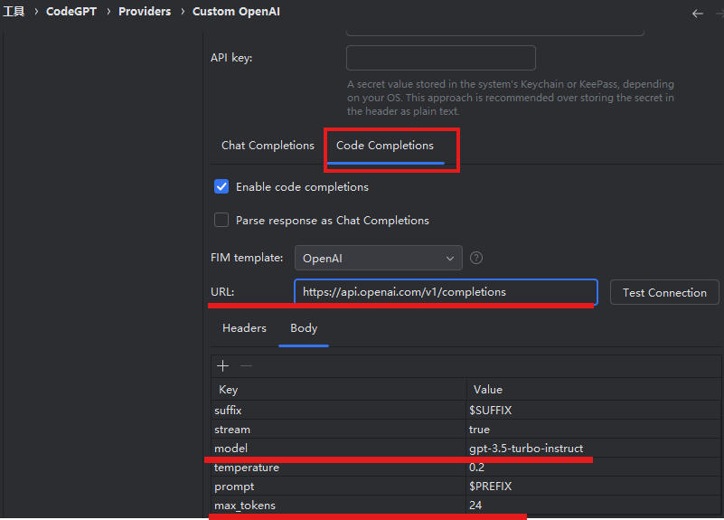

这样就能使用代码补全功能了

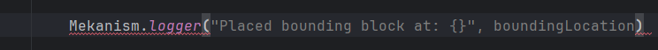

## 修改 prompts

有时，你可能会遇到这种情况：明明提问时用的是中文，但是 AI 却老是给你回答英文？
这可能是使用了英文 prompt 的原因。  
打开设置，转到"设置 > 工具 > CodeGPT > Prompts"。可以看到，Proxy AI 默认的 prompts 都是英文的。
难怪 AI 老是回答英文！

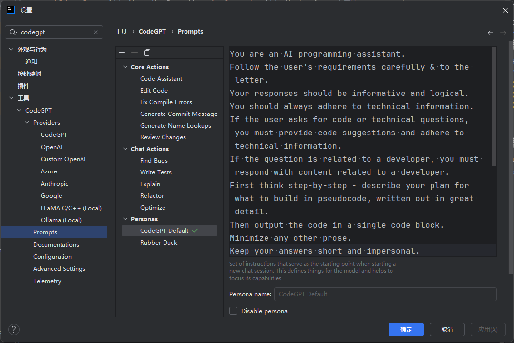

修改 Prompts 很简单，在右边直接改就是。改成中文 prompt 后，AI 就会老老实实回答中文了。
什么，你不会写 prompt？这还不容易

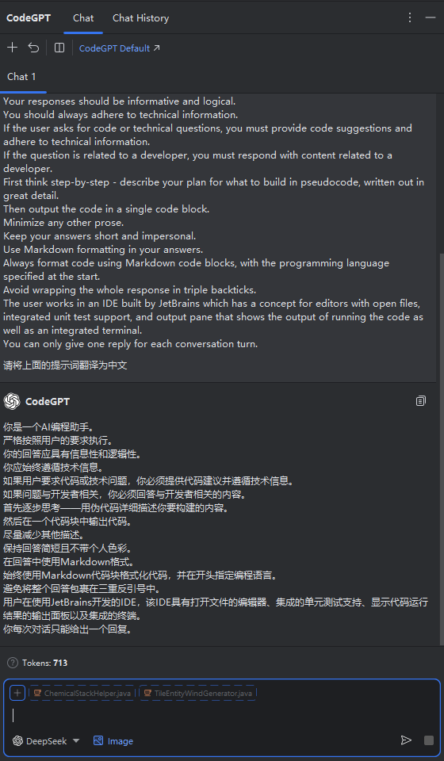

教程就到这里了，祝各位使用愉快！
